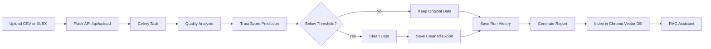

# DataTrace

DataTrace is a full-stack data quality and trust scoring application. It lets you upload a CSV or Excel file, analyzes the dataset, decides whether cleaning is needed, produces a cleaned export when necessary, stores the run history in MySQL, and generates a natural-language report that can be queried through a small RAG-powered assistant.

The project is split into two parts:

- [Backend](Backend) implements the Flask API, Celery background processing, database persistence, trust scoring, cleaning, and the report/assistant pipeline.
- [frontend](frontend) provides the React UI for uploading data, watching task progress, reviewing results, and browsing historical runs.

## What It Does

At a high level, DataTrace answers one question: how trustworthy is this dataset, and what changed after cleaning?

The app does this in a few stages:

1. A user uploads a `.csv` or `.xlsx` file.
2. The backend sends the file to a Celery worker so processing happens asynchronously.
3. The worker analyzes the raw dataset and computes data quality metrics such as missing values, duplicates, outliers, type inconsistencies, constant columns, null-only columns, and skewness.
4. A trust score is predicted from those metrics.
5. If the score is below the configured threshold, the dataset is cleaned.
6. The before/after metrics, trust score, and cleaning actions are stored as a pipeline run.
7. A report is generated and indexed so the assistant can answer questions about that specific run.

## Main Features

- File upload for CSV and Excel datasets.
- Background processing with Celery so large files do not block the API.
- Automatic data quality analysis and trust scoring.
- Conditional cleaning based on a threshold value.
- Downloadable cleaned exports.
- Run history stored in MySQL.
- RAG-backed assistant for asking questions about a specific run or file.
- Frontend progress view with live polling of Celery task status.

## Project Structure

```text
DataTrace/
├── Backend/
│   ├── app.py                # Flask API routes
│   ├── tasks.py              # Celery pipeline task
│   ├── celery_app.py         # Celery configuration
│   ├── config.py             # Paths, threshold, Redis/Ollama settings
│   ├── schema.sql            # MySQL schema for run history
│   ├── services/             # Processing, evaluation, lineage, trust score
│   ├── rag/                  # Report generation and assistant helpers
│   ├── uploads/              # Temporary upload files
│   ├── cleaned_exports/      # Saved cleaned datasets
│   ├── reports/              # Generated run reports
│   └── vector_db/            # Persistent Chroma vector store
├── frontend/
│   ├── src/                  # React app and components
│   ├── vite.config.js        # Dev server proxy to the backend
│   └── package.json          # Frontend scripts and dependencies
└── README.md
```

## Architecture

The app uses a simple but effective pipeline:



## Backend Details

The backend is a Flask application in [Backend/app.py](Backend/app.py). It exposes the API routes used by the frontend and coordinates the rest of the system.

### Key backend components

- [Backend/tasks.py](Backend/tasks.py) runs the background data pipeline.
- [Backend/celery_app.py](Backend/celery_app.py) connects Celery to Redis for both the broker and result backend.
- [Backend/services/processing.py](Backend/services/processing.py) analyzes and cleans data.
- [Backend/services/trust_score.py](Backend/services/trust_score.py) predicts the trust score.
- [Backend/services/lineage.py](Backend/services/lineage.py) stores and retrieves pipeline runs.
- [Backend/services/evaluation.py](Backend/services/evaluation.py) supports the cleaning evaluation endpoint.
- [Backend/rag/assistant.py](Backend/rag/assistant.py) builds reports, indexes them, and answers questions with retrieval support.

### Configuration

[Backend/config.py](Backend/config.py) sets the important runtime values:

- `TRUST_THRESHOLD = 95.0`
- `UPLOAD_DIR` for temporary incoming files
- `EXPORT_DIR` for cleaned files
- `REPORTS_DIR` for generated reports
- `VECTOR_DB_DIR` for the persistent Chroma store
- `redis_url = redis://localhost:6379/0`
- `OLLAMA_MODEL` defaults to `llama3.2:3b`
- `OLLAMA_URL` defaults to `http://localhost:11434`

## Frontend Details

The frontend is a React app built with Vite. It communicates with the backend through `/api` routes, and the Vite dev server proxies those requests to `http://localhost:5000`.

The UI includes:

- an upload screen for dataset submission,
- a loading screen that shows task state and progress,
- a results view with quality metrics and trust score visuals,
- a history table for previous runs,
- and an assistant-oriented results experience for explaining a run.

## Database

The project uses MySQL for storing pipeline history. The schema is defined in [Backend/schema.sql](Backend/schema.sql).

The primary table is `pipeline_runs`, which stores:

- filename
- upload timestamp
- before/after row counts
- before/after missing percentage
- before/after duplicate percentage
- before/after outlier percentage
- before/after trust score
- whether cleaning was applied
- confidence level

Run the schema before starting the backend.

## API Endpoints

### `POST /api/upload`

Uploads a file and starts background processing.

Accepted file types:

- `.csv`
- `.xlsx`

Returns a Celery task id and a status URL.

### `GET /api/tasks/<task_id>`

Returns the current task state for the frontend polling loop.

Possible states include `PENDING`, `PROGRESS`, `SUCCESS`, and `FAILURE`.

### `GET /api/health`

Simple health check that also returns the configured trust threshold.

### `POST /api/evaluate-cleaning`

Runs a synthetic cleaning-quality evaluation on an uploaded file.

Form fields:

- `file`
- `mask_fraction`
- `duplicate_fraction`
- `random_state`

### `GET /api/download/<key>/<filename>`

Downloads a cleaned export if one was generated for the run.

### `GET /api/history`

Returns all saved pipeline runs.

### `GET /api/history/<run_id>`

Returns one saved run by id.

### `POST /api/chat`

Answers a question using the indexed run report.

Request body:

```json
{
  "question": "Why did the trust score drop?",
  "run_id": 12,
  "filename": "sales_data.csv"
}
```

The backend uses the stored report and vector index to answer in context.

### `POST /api/rag/reindex`

Rebuilds the RAG index from the saved reports.

## Setup

The project needs three services running locally:

- MySQL for run history
- Redis for Celery
- Ollama for the assistant model

### 1. Set up the database

Create the MySQL database and table from [Backend/schema.sql](Backend/schema.sql).

### 2. Start Redis

Celery uses Redis as both broker and result backend, so Redis must be available at `redis://localhost:6379/0` unless you change [Backend/config.py](Backend/config.py).

### 3. Start the backend

Install the Python dependencies from [Backend/requirements.txt](Backend/requirements.txt), then run the Flask app from the `Backend` folder.

The backend listens on port `5000`.

### 4. Start a Celery worker

The background processing task lives in [Backend/tasks.py](Backend/tasks.py). Start a worker that can import that module and connect to the Redis broker.

### 5. Start the frontend

Install the frontend dependencies from [frontend/package.json](frontend/package.json), then run the Vite dev server from the `frontend` folder.

Because the frontend proxy forwards `/api` calls to the Flask server, the backend should be running before you test uploads.

## Environment Variables

The backend can be configured with these environment variables:

- `OLLAMA_MODEL` - model name used by the assistant
- `OLLAMA_URL` - Ollama server URL

Everything else currently uses the defaults defined in [Backend/config.py](Backend/config.py).

## Typical Workflow

1. Open the frontend.
2. Upload a CSV or Excel file.
3. Watch the loading screen while Celery processes the file.
4. Review the before/after metrics and trust score.
5. Download the cleaned file if cleaning was triggered.
6. Open history to inspect older runs.
7. Use the assistant to ask why a score changed or what cleaning actions were applied.

## Notes

- If a dataset already has a trust score above the threshold, the worker may skip cleaning and save the original data as-is.
- Reports are stored on disk and indexed so the assistant can answer questions about prior runs.
- Temporary uploads are deleted after processing.
- The frontend uses polling to track task progress, so there is no websocket requirement.

## Troubleshooting

- If uploads fail immediately, check that the Flask backend is running on port `5000`.
- If tasks stay pending, confirm that Redis and the Celery worker are both running.
- If assistant answers are empty or outdated, reindex the reports with `POST /api/rag/reindex`.
- If cleaned files are missing, confirm that the run actually triggered cleaning and that `Backend/cleaned_exports` exists.

## License

No license file is included in the repository at the moment.